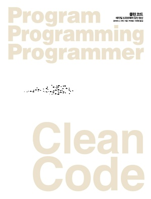

> ## <b># Clean code</b>
- Clean code - 애자일 소프트웨어 장인 정신 by Robert C.Martin
- 

## <b># chapter</b>

> 1. [깨끗한 코드]()
> 2. [의미 있는 이름]()
> 3. [함수]()
> 4. [주석]()
> 5. [형식 맞추기]()
> 6. [객체와 자료 구조]()
> 7. [오류 처리]()
> 8. [경계]()
> 9. [단위 테스트]()
> 10. [클래스]()
> 11. [시스템]()
> 12. [창발성]()
> 13. [동시성]()
> 14. [점진적인 개선(+ ver.TypeScript)]()
> 15. [JUnit 들여다보기]()
> 16. [SerialDate 리팩터링]()
> 17. [냄새와 휴리스틱]()
> 18. [마무리]()

